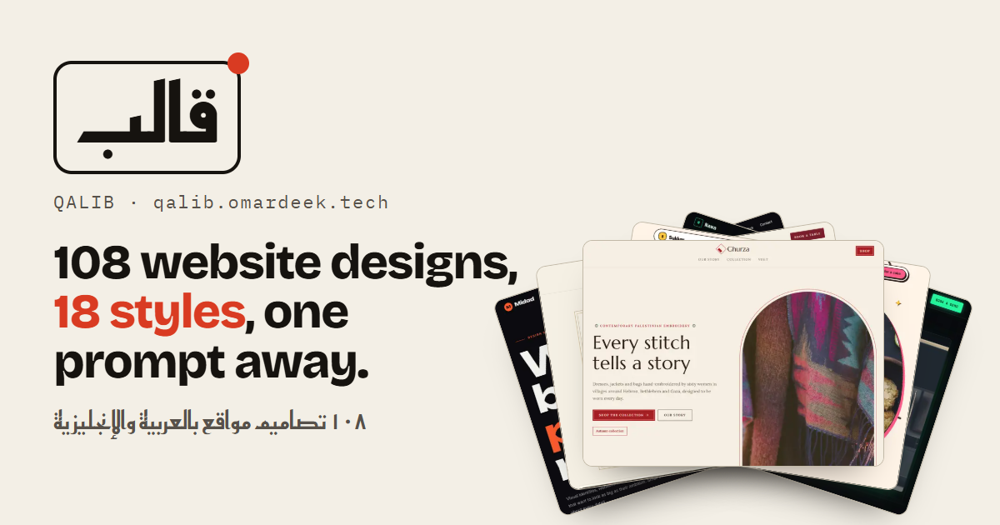

# Qalib · قالب

A library of website designs. 108 designs in 18 styles, each with a live demo in Arabic and English and a detailed prompt that tells Claude Code how to build a site in that style.

**Live:** https://qalib.omardeek.tech



## How it works

1. **Pick a design.** Every design is a complete one-page site for a believable business, in Arabic (RTL) and English, viewable at desktop, tablet and phone widths.
2. **Describe your project.** Name, type of site, languages, pages, stack and contact details. The brief is saved in your browser and follows you from design to design.
3. **Copy the prompt.** It spells out the design exactly: colour tokens, fonts and weights, the treatment of every section, motion, decorations, Arabic and accessibility rules, and links to the demo, whose single HTML file is the reference implementation. Paste it into Claude Code.

## The styles

Classic, Vintage, Modern, Animated, Heritage, Digital, Minimal, Luxury, Playful, Editorial, Brutalist, Glass, Retro, Organic, Art Deco, Hand-drawn, Geometric and Conventional, six designs each, across twenty kinds of business: restaurants, cafes, sweets, farm shops, contractors, agencies, software companies, clinics, perfumers, boutiques, photographers, apps, weddings, conferences, sign workshops, hotels, academies, gyms, real estate and law firms.

## How it is built

Designs are data. A design names a style, a demo business, a palette, fonts, a layout variant for each section and a few decorations (`src/catalog/designs/<style>.ts`). At build time `scripts/build-demos.tsx` renders every design to static HTML with React: shared, semantic section markup, a base stylesheet that lays out every variant (`src/demo/css/base.css`) and one stylesheet per style that gives it its identity (`src/demo/css/kits/<style>.css`). The prompt builder (`src/prompt`) reads the same data, so the prompt always describes what the demo shows.

```
src/catalog/   designs, styles, demo businesses (profiles), fonts
src/demo/      demo engine: sections, decorations, runtime script, CSS
src/prompt/    prompt builder and its Arabic and English text
src/app/       the Next.js 16 library (/ar, /en)
src/ui/        library components
scripts/       build-demos, images, thumbs, og
```

Fonts come from fontsource and are self-hosted; only the Arabic, Latin and Latin-extended files of the weights in use are copied. Nothing is loaded from another site.

## Scripts

```bash
npm install
npm run dev         # builds the demos, then starts Next.js
npm run build       # builds the demos, then the static site
npm run images      # downloads any new demo photos into public/img
npm run thumbs      # screenshots every demo for the cards (needs Microsoft Edge)
node scripts/og.mjs # the social preview image
npm run test:unit   # catalogue integrity and prompt builder
npm test            # Playwright end-to-end tests
npm run lint && npm run typecheck
```

## Adding a design

Add an entry to the style's file in `src/catalog/designs/`, pick a demo business from `src/catalog/profiles/`, run `npm run demos` and `npm run thumbs`, and check it at desktop and phone width. `npm run test:unit` catches unknown fonts, layouts, decorations, missing photos and unreadable palettes.

## Credits

Photos from [Unsplash](https://unsplash.com) via [Lorem Picsum](https://picsum.photos), under the Unsplash licence. Fonts under the SIL Open Font License, packaged by [fontsource](https://fontsource.org). Icons from [Lucide](https://lucide.dev) (ISC). Every business in the demos is fictional.

Code under the MIT licence. Made by [Omar Aldeek](https://omardeek.tech).
